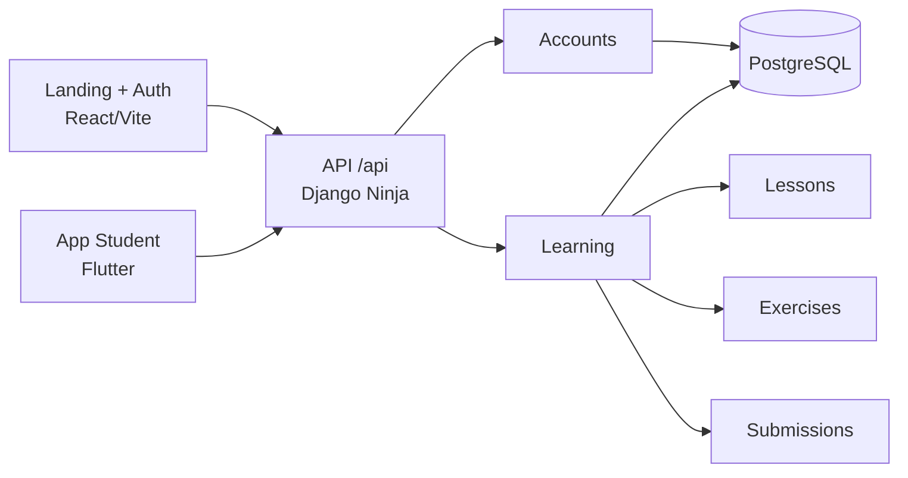

<h1 align="center">Vibe Studying</h1>

<p align="center">
  O Vibe Studying é um projeto educacional que transforma a lógica do feed infinito em uma experiência de estudo.
  Em vez de consumir conteúdo vazio, o usuário navega por lessons curtas inspiradas na cultura pop, com foco em aprendizagem rápida e repetível.
</p>

<p align="center">
  
  
  
  
  
</p>

<p align="center">
  
</p>

## Visão Geral

O projeto foi estruturado como um desafio técnico end-to-end e, hoje, já entrega uma base funcional com:

- landing page pública com identidade visual forte
- autenticação com JWT customizado
- cadastro separado para aluno e professor
- feed público de lessons publicadas
- detalhe de lesson com exercise vinculado
- criação e edição de lessons pelo professor
- envio e consulta de submissions pelo aluno
- captura real de waitlist pela landing pública
- app mobile Flutter versionado no monorepo com login, onboarding, feed personalizado e prática inicial
- cache local inicial e fila offline de tentativas no mobile
- base de Docker e CI para backend/frontend
- testes básicos no backend e no frontend

## Status Atual

- O que está implementado no código: landing page web, autenticação, API em Django Ninja, waitlist pública, perfil do aluno, feed personalizado, domínio de learning, app mobile Flutter inicial, cache offline básico no mobile e testes principais do backend.
- O que já existe apenas de forma parcial: SEO básico da landing, portal autenticado web, prática mobile, sincronização pendente do mobile e pipeline de distribuição do app.
- O que ainda não está implementado neste repositório: e-mails assíncronos reais, scheduler de lembretes, pipeline real de IA, monitoramento robusto e automações avançadas de produção.

## Documentação Base

- `PRD.md`: visão de produto, escopo, riscos e fases de execução
- `TechSpecs.md`: decisões técnicas e direção principal do app mobile
- `backend/README.md`: enunciado original do desafio

## Stack

| Camada | Tecnologia |
| --- | --- |
| Frontend | React 18, Vite, TypeScript, Tailwind CSS, shadcn/ui e Framer Motion |
| Backend | Django 6, Django Ninja e JWT customizado |
| Mobile | Flutter, Riverpod, Go Router, Dio e Secure Storage |
| Banco | PostgreSQL |
| Testes | Vitest, Testing Library e Django TestCase |
| UX | Visual cyberpunk, alto contraste e linguagem inspirada em HUD/feed |

## Arquitetura



## Fluxo Principal

1. O usuário cria uma conta ou faz login via `api/auth/*`.
2. O backend retorna `access_token`, `refresh_token` e os dados resumidos do usuário.
3. Professores podem criar lessons com exercise embutido.
4. Lessons publicadas entram no feed público consumido pelo frontend.
5. Alunos enviam submissions para exercícios e acompanham o próprio histórico.

## Estrutura do Repositório

```text
.
├── backend/
│   ├── accounts/
│   ├── learning/
│   ├── config/
│   ├── manage.py
│   └── requirements.txt
├── frontend/
│   ├── src/
│   │   ├── components/
│   │   ├── pages/
│   │   ├── lib/
│   │   └── test/
│   └── package.json
├── mobile/
│   ├── lib/
│   ├── android/
│   ├── ios/
│   └── pubspec.yaml
├── PRD.md
├── TechSpecs.md
└── README.md
```

## Como Rodar

### Backend

Requisitos:

- Python 3.12+
- PostgreSQL

```bash
cd backend
python -m venv .venv
source .venv/bin/activate
pip install -r requirements.txt
cp .env.example .env
python manage.py migrate
python manage.py runserver
```

API disponível em `https://backendvibestudying.planoartistico.com/api`.

Se quiser verificar rapidamente se a API subiu, use `GET /api/health`.

### Frontend

Requisitos:

- Node.js 20+
- npm

Crie um arquivo `.env` dentro de `frontend/` com:

```env
VITE_API_URL=https://backendvibestudying.planoartistico.com/api
VITE_ANDROID_APP_URL=
VITE_FLUTTER_ANDROID_URL=
```

Depois, rode:

```bash
cd frontend
npm install
npm run dev
```

Aplicação web disponível em `http://localhost:8080` ou na porta informada pelo Vite.

### Docker Compose

Para subir a stack local com Postgres, Redis, backend e frontend:

```bash
docker compose up --build
```

Serviços esperados:

- frontend em `http://localhost:8080`
- backend em `https://backendvibestudying.planoartistico.com/api`
- PostgreSQL em `localhost:5432`
- Redis em `localhost:6379`

## Variáveis de Ambiente

### Backend

| Variável | Descrição |
| --- | --- |
| `DEBUG` | Ativa o modo de desenvolvimento |
| `SECRET_KEY` | Chave principal do Django |
| `ALLOWED_HOSTS` | Hosts permitidos |
| `CORS_ALLOWED_ORIGINS` | Origens liberadas para o frontend |
| `CSRF_TRUSTED_ORIGINS` | Origens confiáveis para CSRF |
| `DATABASE_NAME` | Nome do banco PostgreSQL |
| `DATABASE_USER` | Usuário do banco |
| `DATABASE_PASSWORD` | Senha do banco |
| `DATABASE_HOST` | Host do banco |
| `DATABASE_PORT` | Porta do banco |
| `JWT_SECRET_KEY` | Chave para assinatura dos tokens |
| `JWT_ACCESS_TOKEN_LIFETIME_MINUTES` | Duração do access token |
| `JWT_REFRESH_TOKEN_LIFETIME_DAYS` | Duração do refresh token |
| `ENABLE_PUBLIC_TEACHER_SIGNUP` | Habilita ou bloqueia cadastro público de professor |
| `EMAIL_BACKEND` | Backend de e-mail do Django |
| `DEFAULT_FROM_EMAIL` | Remetente padrão |
| `LOG_LEVEL` | Nível de log raiz |

### Frontend

| Variável | Descrição |
| --- | --- |
| `VITE_API_URL` | URL base da API Django Ninja |
| `VITE_ANDROID_APP_URL` | Link do APK Android |
| `VITE_FLUTTER_ANDROID_URL` | Link da build Flutter Android |

## Endpoints Principais

| Método | Rota | Função |
| --- | --- | --- |
| `GET` | `/api/health` | Health check da API |
| `POST` | `/api/auth/register` | Cadastro de aluno |
| `POST` | `/api/auth/register/teacher` | Cadastro de professor |
| `POST` | `/api/auth/login` | Login |
| `POST` | `/api/auth/refresh` | Renovação de token |
| `GET` | `/api/auth/me` | Perfil autenticado |
| `POST` | `/api/waitlist` | Captura de e-mail da landing |
| `GET` | `/api/feed` | Feed público de lessons |
| `GET` | `/api/lessons/{slug}` | Detalhe de uma lesson |
| `GET` | `/api/teacher/lessons` | Lista de lessons do professor |
| `POST` | `/api/teacher/lessons` | Cria uma lesson com exercise |
| `PUT` | `/api/teacher/lessons/{lesson_id}` | Atualiza a lesson |
| `POST` | `/api/submissions` | Envia a tentativa do aluno |
| `GET` | `/api/submissions/me` | Lista o histórico do aluno |

## Testes

### Backend

```bash
cd backend
source .venv/bin/activate
python manage.py test
```

### Frontend

```bash
cd frontend
npm install
npm run test
```

## Roadmap

- endurecimento de segurança e contratos do backend
- SEO básico completo e alinhamento do frontend ao estado real do produto
- app Flutter offline-first com cache local inicial e fila de sincronização
- processamento assíncrono para e-mails, lembretes e futuras correções
- observabilidade, deploy, Docker e CI/CD

## Nota

Este README descreve o estado atual do código. A identidade visual da landing page ainda comunica uma visão de produto maior do que o MVP técnico já fechado; por isso, a documentação de produto e arquitetura passa a ser a referência principal para separar visão, base implementada e próximas entregas.
