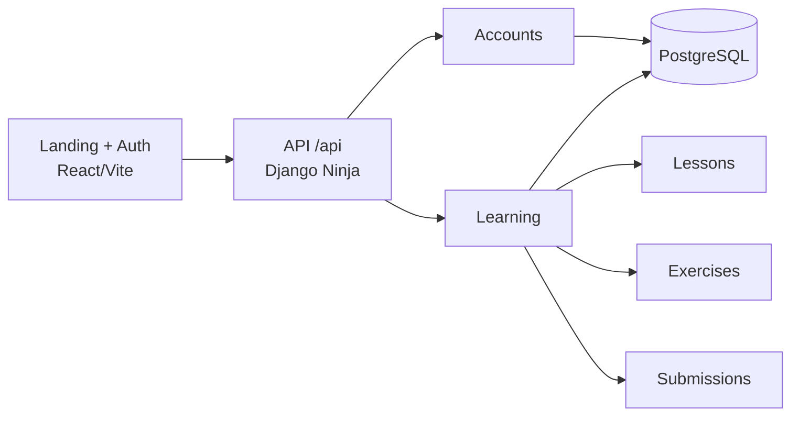

<h1 align="center">Vibe Studying</h1>

<p align="center">
  O Vibe Studying e um projeto educacional que transforma a logica de feed infinito em experiencia de estudo.
  Em vez de consumir conteudo vazio, o usuario navega por lessons curtas inspiradas em cultura pop, com foco em aprendizagem rapida e repetivel.
</p>

<p align="center">
  
  
  
  
  
</p>

<p align="center">
  
</p>

## Overview

O projeto foi estruturado como um desafio tecnico end-to-end e hoje ja entrega uma base funcional com:

- landing page publica com identidade visual forte
- autenticacao com JWT customizado
- cadastro separado para aluno e professor
- feed publico de lessons publicadas
- detalhe de lesson com exercise vinculado
- criacao e edicao de lessons pelo professor
- envio e consulta de submissions pelo aluno
- testes basicos no backend e no frontend

## Status Atual

- O que esta implementado no codigo: landing page, tela de auth, API Django Ninja, dominio de learning, JWT e testes principais.
- O que aparece como visao de produto na interface: IA de pronuncia, app Flutter e workflows assincronos.
- O que ainda nao esta implementado neste repositorio: pipeline real de IA, app mobile versionado aqui e orquestracao com Temporal.

## Stack

| Camada | Tecnologia |
| --- | --- |
| Frontend | React 18, Vite, TypeScript, Tailwind CSS, shadcn/ui, Framer Motion |
| Backend | Django 6, Django Ninja, JWT customizado |
| Banco | PostgreSQL |
| Testes | Vitest, Testing Library, Django TestCase |
| UX | Visual cyberpunk, alto contraste, linguagem inspirada em HUD/feed |

## Arquitetura



## Fluxo Principal

1. O usuario cria conta ou faz login via `api/auth/*`.
2. O backend retorna `access_token`, `refresh_token` e dados resumidos do usuario.
3. Professores podem criar lessons com exercise embutido.
4. Lessons publicadas entram no feed publico consumido pelo frontend.
5. Alunos enviam submissions para exercicios e acompanham o proprio historico.

## Estrutura Do Repositorio

```text
.
├── backend/
│   ├── accounts/
│   ├── learning/
│   ├── config/
│   ├── manage.py
│   └── requirements.txt
├── frontend/
│   ├── src/
│   │   ├── components/
│   │   ├── pages/
│   │   ├── lib/
│   │   └── test/
│   └── package.json
└── README.md
```

## Como Rodar

### Backend

Requisitos:

- Python 3.12+
- PostgreSQL

```bash
cd backend
python -m venv .venv
source .venv/bin/activate
pip install -r requirements.txt
cp .env.example .env
python manage.py migrate
python manage.py runserver
```

API disponivel em `http://localhost:8000/api`.

Se quiser testar rapidamente se a API subiu, use `GET /api/health`.

### Frontend

Requisitos:

- Node.js 20+
- npm

Crie um arquivo `.env` dentro de `frontend/` com:

```env
VITE_API_URL=http://localhost:8000/api
VITE_ANDROID_APP_URL=
VITE_FLUTTER_ANDROID_URL=
```

Depois rode:

```bash
cd frontend
npm install
npm run dev
```

App web disponivel em `http://localhost:8080` ou na porta informada pelo Vite.

## Variaveis De Ambiente

### Backend

| Variavel | Descricao |
| --- | --- |
| `DEBUG` | Liga modo de desenvolvimento |
| `SECRET_KEY` | Chave principal do Django |
| `ALLOWED_HOSTS` | Hosts permitidos |
| `CORS_ALLOWED_ORIGINS` | Origens liberadas para o frontend |
| `CSRF_TRUSTED_ORIGINS` | Origens confiaveis para CSRF |
| `DATABASE_NAME` | Nome do banco PostgreSQL |
| `DATABASE_USER` | Usuario do banco |
| `DATABASE_PASSWORD` | Senha do banco |
| `DATABASE_HOST` | Host do banco |
| `DATABASE_PORT` | Porta do banco |
| `JWT_SECRET_KEY` | Chave para assinatura dos tokens |
| `JWT_ACCESS_TOKEN_LIFETIME_MINUTES` | Duracao do access token |
| `JWT_REFRESH_TOKEN_LIFETIME_DAYS` | Duracao do refresh token |

### Frontend

| Variavel | Descricao |
| --- | --- |
| `VITE_API_URL` | Base URL da API Django Ninja |
| `VITE_ANDROID_APP_URL` | Link do APK Android |
| `VITE_FLUTTER_ANDROID_URL` | Link da build Flutter Android |

## Endpoints Principais

| Metodo | Rota | Funcao |
| --- | --- | --- |
| `GET` | `/api/health` | Health check da API |
| `POST` | `/api/auth/register` | Cadastro de aluno |
| `POST` | `/api/auth/register/teacher` | Cadastro de professor |
| `POST` | `/api/auth/login` | Login |
| `POST` | `/api/auth/refresh` | Renovacao de token |
| `GET` | `/api/auth/me` | Perfil autenticado |
| `GET` | `/api/feed` | Feed publico de lessons |
| `GET` | `/api/lessons/{slug}` | Detalhe de uma lesson |
| `GET` | `/api/teacher/lessons` | Lista lessons do professor |
| `POST` | `/api/teacher/lessons` | Cria lesson com exercise |
| `PUT` | `/api/teacher/lessons/{lesson_id}` | Atualiza lesson |
| `POST` | `/api/submissions` | Envia tentativa do aluno |
| `GET` | `/api/submissions/me` | Lista historico do aluno |

## Testes

### Backend

```bash
cd backend
source .venv/bin/activate
python manage.py test
```

### Frontend

```bash
cd frontend
npm install
npm run test
```

## Roadmap

- avaliacao automatica de pronuncia com pipeline real de IA
- roteamento completo do portal autenticado no frontend
- app Flutter offline-first integrado ao backend
- processamento assincrono para correcoes e distribuicao de conteudo
- observabilidade, deploy e CI/CD

## Nota

Este README descreve o estado atual do codigo. A identidade visual da landing page comunica uma visao de produto maior do que o MVP implementado hoje, e isso foi mantido de forma intencional para apresentar o potencial da plataforma sem mascarar o escopo real entregue.
