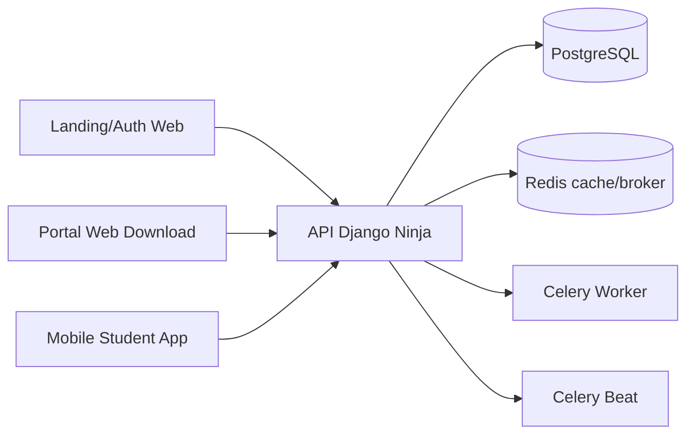

# Tech Specs - Vibe Studying

Doc status: especificacao tecnica alinhada ao codigo real do monorepo em 2026-04-30.

## Objetivo

Documentar a arquitetura atual do Vibe Studying com foco em tres pontos:

- como o sistema funciona hoje
- quais contratos ja estao estaveis
- quais gaps tecnicos precisam ser tratados antes de evoluir o produto

## Resumo Executivo

O sistema e um monorepo com tres superficies:

- `backend/`: Django + Django Ninja, source of truth para auth, profile, learning e operations
- `frontend/`: React + Vite, usado hoje para landing, auth simples e portal de downloads
- `mobile/`: Flutter, principal experiencia de estudo para o aluno

Arquitetura recomendada para continuidade: manter o backend monolitico como nucleo do dominio e evoluir web/mobile consumindo os mesmos contratos HTTP.

## Estrutura Do Repositorio

```text
.
|- backend/
|  |- accounts/
|  |- learning/
|  |- operations/
|  |- config/
|  `- scripts/
|- frontend/
|  |- src/
|  |  |- components/
|  |  |- pages/
|  |  |- lib/
|  |  `- test/
|  `- package.json
|- mobile/
|  |- lib/
|  |  |- app/
|  |  |- core/
|  |  |- features/
|  |  `- shared/
|  `- pubspec.yaml
|- docker-compose.yml
|- .github/workflows/ci.yml
|- codemagic.yaml
|- PRD.md
|- TechSpecs.md
`- DESIGN.md
```

## Stack Por Camada

| Camada | Stack real |
| --- | --- |
| Backend | Python 3.12, Django 6, Django Ninja, PostgreSQL, Celery, Redis |
| Frontend | React 18, Vite, TypeScript, Tailwind CSS, shadcn/ui, Framer Motion |
| Mobile | Flutter, Riverpod, GoRouter, Dio, Flutter Secure Storage, SharedPreferences, speech_to_text |
| Infra | Docker Compose, GitHub Actions, Codemagic |

## Arquitetura De Sistema



### Papel De Cada Superficie

- Backend: contratos, autorizacao, modelos, operacao e cache
- Web: aquisicao, autenticacao basica, distribuicao de artefatos Android
- Mobile: onboarding, feed personalizado, pratica e resiliencia offline

## Backend

### Modulos

#### `accounts`

Responsabilidades:

- user customizado por e-mail
- JWT custom
- cadastro, login, refresh, `me`
- profile do aluno
- onboarding
- waitlist publica

Arquivos-chave:

- `backend/accounts/models.py`
- `backend/accounts/api.py`
- `backend/accounts/jwt.py`

#### `learning`

Responsabilidades:

- feed publico
- feed personalizado
- detalhe de lesson
- CRUD de lesson para professor
- submissions do aluno

Arquivos-chave:

- `backend/learning/models.py`
- `backend/learning/api.py`

#### `operations`

Responsabilidades:

- fila de e-mails
- templates transacionais simples
- reminders de inatividade
- checks operacionais por threshold

Arquivos-chave:

- `backend/operations/models.py`
- `backend/operations/emailing.py`
- `backend/operations/tasks.py`

### Roteamento Da API

Entrada principal: `backend/config/api.py`

Rotas montadas:

- `/api/auth/*`
- `/api/profile/*`
- `/api/waitlist`
- `/api/feed`
- `/api/feed/personalized`
- `/api/lessons/{slug}`
- `/api/teacher/lessons`
- `/api/submissions`
- `/api/submissions/me`
- `/api/health`

### Endpoints Principais

| Metodo | Rota | Uso |
| --- | --- | --- |
| `POST` | `/api/waitlist` | captura de lead |
| `POST` | `/api/auth/register` | cadastro de aluno |
| `POST` | `/api/auth/register/teacher` | cadastro de professor |
| `POST` | `/api/auth/login` | login |
| `POST` | `/api/auth/refresh` | renovacao de sessao |
| `GET` | `/api/auth/me` | identidade autenticada |
| `GET` | `/api/profile/me` | profile do aluno |
| `PUT` | `/api/profile/me` | atualizacao de profile |
| `POST` | `/api/profile/onboarding` | conclusao de onboarding |
| `GET` | `/api/feed` | feed publico |
| `GET` | `/api/feed/personalized` | feed ranqueado por preferencias |
| `GET` | `/api/lessons/{slug}` | detalhe de lesson |
| `GET` | `/api/teacher/lessons` | lista lessons do professor |
| `POST` | `/api/teacher/lessons` | cria lesson |
| `PUT` | `/api/teacher/lessons/{lesson_id}` | edita lesson |
| `POST` | `/api/submissions` | cria submission |
| `GET` | `/api/submissions/me` | historico do aluno |
| `GET` | `/api/health` | health check operacional |

## Modelo De Dominio

### Entidades Principais

| Entidade | Papel | Relacoes |
| --- | --- | --- |
| `User` | usuario do sistema | 1:N com `Lesson`, 1:N com `Submission`, 1:1 com `StudentProfile` |
| `StudentProfile` | preferencias e onboarding | 1:1 com `User` |
| `WaitlistSignup` | lead da landing | isolado |
| `Lesson` | item do feed | N:1 com `User(teacher)`, 1:1 com `Exercise` |
| `Exercise` | desafio de uma lesson | 1:1 com `Lesson`, 1:N com `ExerciseLine`, 1:N com `Submission` |
| `ExerciseLine` | linha da pratica | N:1 com `Exercise` |
| `Submission` | tentativa do aluno | N:1 com `User(student)`, N:1 com `Exercise`, 1:N com `SubmissionLine` |
| `SubmissionLine` | resultado por linha | N:1 com `Submission`, N:1 opcional com `ExerciseLine` |
| `EmailDelivery` | fila de e-mails | isolado |

### Observacoes De Modelagem

- `Lesson` e a unidade principal do feed; nao existe conceito de curso ou modulo
- cada `Lesson` tem exatamente um `Exercise`
- `Exercise` pode ter multiplas `ExerciseLine`
- `Submission` nasce em `pending`
- scores do backend ainda nao sao processados por pipeline confiavel
- idempotencia de envio e garantida por `client_submission_id` por aluno

## Logica De Feed Personalizado

Implementada em `backend/learning/api.py`.

Sinais usados hoje:

- match textual com `favorite_songs`
- match textual com `favorite_movies`
- match textual com `favorite_series`
- match textual com `favorite_anime`
- match textual com `favorite_artists`
- match textual com `favorite_genres`
- pequeno bonus por compatibilidade de `content_type`
- tentativa de usar historico por `final_score`

Limitacao importante:

- o codigo consulta `Submission.final_score` para sugerir review/mastery
- hoje nao existe processor que preencha `final_score`
- na pratica, a personalizacao real depende quase toda de match de preferencias declaradas

## Contrato De Submission

Payload aceito:

- `exercise_id`
- `client_submission_id`
- `transcript_en`
- `transcript_pt`
- `line_results[]`

Comportamento atual:

- se `client_submission_id` ja existe para o aluno, backend retorna a mesma submission
- backend persiste apenas texto e vinculo de linha
- scores e feedback enviados pelo cliente sao descartados
- `SubmissionLine` e criada como `pending`, sem score confiavel

Conclusao:

- o mobile pode usar heuristicas locais para UX
- o backend preserva neutralidade para uma avaliacao futura mais confiavel

## Web Client

### Escopo Atual

- landing page publica
- CTA de waitlist
- tela de login/cadastro do aluno
- portal autenticado para links Android

### Arquitetura Atual

- `frontend/src/App.tsx` controla as rotas
- `frontend/src/pages/Home.tsx` escolhe entre landing e portal autenticado
- `frontend/src/lib/auth.ts` salva sessao em `localStorage`

### Limites Atuais

- nao ha feed web
- nao ha lesson detail web
- nao ha teacher dashboard web
- nao ha onboarding web

## Mobile Client

### Arquitetura Atual

Camadas principais:

- `app/`: bootstrap, tema e rotas
- `core/models.dart`: contratos tipados
- `core/repositories.dart`: HTTP, storage e cache local
- `core/state.dart`: estado global com Riverpod
- `features/`: auth, onboarding, feed e practice
- `shared/`: componentes HUD reutilizaveis

### Fluxo De Sessao

1. app abre em `/`
2. splash carrega base URL e sessao persistida
3. tenta `GET /auth/me`
4. se offline, reaproveita sessao armazenada
5. se token expirou, tenta refresh
6. se profile nao estiver onboarded, manda para onboarding
7. senao, manda para feed

### Offline-First No Mobile

Persistencia local:

- sessao em `FlutterSecureStorage`
- profile em `SharedPreferences`
- feed em `SharedPreferences`
- lesson detail em `SharedPreferences`
- fila de submissions em `SharedPreferences`

Comportamento:

- leitura de profile/feed/lesson faz fallback para cache quando erro parece offline
- `submitPractice` faz fila local se a conexao falhar
- `syncPendingSubmissions` roda antes do carregamento do feed personalizado

### Limites Atuais Do Mobile

- sincronizacao roda em momento oportunista, nao em background real
- reconhecimento de fala e local, sem scoring server-side
- foto de perfil e apenas local, sem upload para backend
- nao existe tela de historico de progresso do aluno

## Operacao E Infra

### Banco

- PostgreSQL como banco principal
- sem suporte real a SQLite

### Cache

- Redis quando `CACHE_URL` aponta para redis
- fallback para `LocMemCache` quando nao ha Redis
- cache versionado para feed publico e lesson detail

### Filas

- Celery worker processa entregas de e-mail
- Celery beat agenda:
  - dispatch de e-mails pendentes
  - reminders de inatividade
  - checks operacionais

### Health Check

`GET /api/health` valida:

- banco
- cache
- broker
- thresholds operacionais carregados

### Docker Compose

Stack local prevista:

- `db`
- `redis`
- `backend`
- `worker`
- `beat`
- `frontend`

### CI

GitHub Actions executa:

- backend: `python manage.py check` e `python manage.py test`
- frontend: `npm run test` e `npm run build`

### Mobile CI

Codemagic roda:

- `flutter pub get`
- `flutter test`
- build iOS simulator

## Seguranca E Riscos Tecnicos

### Pontos Positivos

- user customizado ja consolidado
- roles separadas em nivel de dominio
- endpoints protegidos por Bearer JWT
- idempotencia para submissions mobile

### Gaps Reais

- JWT custom sem revogacao ou rotation
- web guarda token em `localStorage`
- `CORS_ALLOW_ALL_ORIGINS=True` por default
- `SECRET_KEY` e `JWT_SECRET_KEY` tem fallbacks inseguros
- teacher signup pode ficar publico em ambientes mal configurados

## Testes

### Backend

Cobre bem o MVP para:

- auth e profile
- waitlist
- feed e lesson detail
- submissions com idempotencia
- scheduler e checks operacionais

### Frontend

Cobertura atual insuficiente. Existe apenas teste basico placeholder.

### Mobile

Cobertura ainda leve para a complexidade do fluxo offline/practice.

## Decisoes Tecnicas Recomendadas Para O Proximo Ciclo

### 1. Endurecer O Que Ja Existe

- remover defaults inseguros de producao
- revisar CORS e teacher signup por ambiente
- aumentar testes de auth web e offline mobile

### 2. Fechar O Loop De Aprendizagem

- implementar processor server-side para `Submission`
- preencher `score_en`, `score_pt`, `final_score`, `processed_at`
- tornar o feed personalizado dependente de sinais de aprendizado reais

### 3. Evoluir As Superficies Certas

- usar o web para professor e operacao antes de transformar a web em experiencia de aluno completa
- manter o mobile como superficie principal para pratica

### 4. Melhorar Telemetria

- eventos de onboarding
- eventos de inicio/fim de pratica
- taxa de sync offline -> online
- backlog operacional por ambiente

## Fonte De Verdade

Para leitura rapida do sistema, os arquivos mais importantes hoje sao:

- `backend/config/api.py`
- `backend/accounts/api.py`
- `backend/learning/api.py`
- `backend/operations/tasks.py`
- `mobile/lib/core/repositories.dart`
- `mobile/lib/core/state.dart`
- `frontend/src/App.tsx`
- `frontend/src/lib/auth.ts`

Esses arquivos devem continuar sendo a referencia principal para evolucao de contrato, fluxo e responsabilidades.
